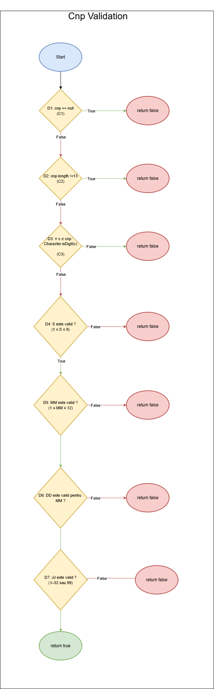

# TSS Proiect Laborator — CNP Validator
**Pasare Roxana-Francisca, Software Engineering, grupa 506**

## Descrierea Proiectului
Acest proiect implementează un **validator de CNP (Cod Numeric Personal)** care verifică dacă un CNP introdus de utilizator respectă regulile de structură și validitate. Validatorul primește un șir de caractere (`String`) și returnează o valoare booleană care indică dacă CNP-ul este valid sau nu.

## Input
Input-ul este un șir de caractere (`String`), reprezentând CNP-ul introdus de utilizator.

## Output
Output-ul este o valoare booleană:
- `true` – dacă CNP-ul este valid conform criteriilor specificate
- `false` – în caz contrar

## Criterii de Validare
Un CNP este considerat valid dacă îndeplinește următoarele condiții:
1. CNP-ul nu este `null`
2. CNP-ul are exact **13 caractere**
3. Toate caracterele sunt **cifre (0–9)**
4. Structura CNP-ului este validă:
   - Prima cifră (`S`) este între `1` și `9`
   - Luna nașterii (`MM`) este între `01` și `12`
   - Ziua nașterii (`DD`) este validă pentru luna respectivă
   - Codul de județ (`JJ`) este între `01` și `52` sau egal cu `99`


---

# Cerința 1: Generarea datelor de test

## a) Equivalence Partitioning (EP)

Pentru a testa validatorul de CNP, au fost identificate următoarele partiții de echivalență:

| ID  | CNP exemplu        | Partiție acoperită                           | Rezultat |
|-----|-------------------|----------------------------------------------|----------|
| EP1 | `null`            | CNP null                                     | false    |
| EP2 | `123`             | Lungime < 13                                 | false    |
| EP3 | `12345678901234`  | Lungime > 13                                 | false    |
| EP4 | `1A34567890123`   | Conține caractere non-numerice               | false    |
| EP5 | `0234567890123`   | Prima cifră (S) invalidă                     | false    |
| EP6 | `1991367890123`   | Lună invalidă                                | false    |
| EP7 | `1990232890123`   | Zi invalidă                                  | false    |
| EP8 | `1990523450123`   | Toate condițiile valide                      | true     |

Fiecare partiție de echivalență este reprezentată printr-un singur caz de test, presupunând că toate valorile din aceeași clasă sunt tratate identic de către program.

Testele corespunzătoare sunt implementate în clasa **`CnpValidatorEPTest`** folosind JUnit.

---

## b) Boundary Value Analysis (BVA)

Boundary Value Analysis testează valorile de la limitele intervalelor, deoarece acestea sunt punctele unde apar frecvent erori.

### Criteriu testat
Lungimea CNP-ului trebuie să fie **exact 13 caractere**.

| Test ID | CNP exemplu       | Lungime | Rezultat |
|--------|-------------------|---------|----------|
| BVA1   | `123456789012`    | 12      | false    |
| BVA2   | `1234567890123`   | 13      | true     |
| BVA3   | `12345678901234`  | 14      | false    |

Toate celelalte condiții sunt respectate pentru a testa strict limita de lungime.

Testele sunt implementate în clasa **`CnpValidatorBVATest`** folosind JUnit.

---

## c) Cause–Effect Graphing (CEG)

Cause–Effect Graphing este utilizată pentru a lega condițiile de intrare (cauze) de rezultatul metodei (efect).

### Cauze (input conditions)

| Cod | Descriere |
|----|----------|
| C1 | CNP este null |
| C2 | Lungimea CNP-ului ≠ 13 |
| C3 | CNP conține caractere non-numerice |
| C4 | Prima cifră (S) invalidă |
| C5 | Luna nașterii invalidă |
| C6 | Ziua nașterii invalidă |
| C7 | Codul de județ invalid |

### Efecte (output)

| Cod | Descriere |
|----|----------|
| E1 | CNP invalid (`false`) |
| E2 | CNP valid (`true`) |

### Tabel de decizie

| Test ID | C1 | C2 | C3 | C4 | C5 | C6 | C7 | E1 | E2 | CNP exemplu |
|--------|----|----|----|----|----|----|----|----|----|------------|
| CE1 | 1 | 0 | 0 | 0 | 0 | 0 | 0 | 1 | 0 | `null` |
| CE2 | 0 | 1 | 0 | 0 | 0 | 0 | 0 | 1 | 0 | `123` |
| CE3 | 0 | 0 | 1 | 0 | 0 | 0 | 0 | 1 | 0 | `1A34567890123` |
| CE4 | 0 | 0 | 0 | 1 | 0 | 0 | 0 | 1 | 0 | `0234567890123` |
| CE5 | 0 | 0 | 0 | 0 | 1 | 0 | 0 | 1 | 0 | `1991367890123` |
| CE6 | 0 | 0 | 0 | 0 | 0 | 1 | 0 | 1 | 0 | `1990232890123` |
| CE7 | 0 | 0 | 0 | 0 | 0 | 0 | 1 | 1 | 0 | `1990523990123` |
| CE8 | 0 | 0 | 0 | 0 | 0 | 0 | 0 | 0 | 1 | `1990523450123` |

Testele sunt implementate în clasa **`CnpValidatorCEGTest`** folosind JUnit.

# Cerința 2: Calcularea acoperirii testelor și comentarea rezultatelor

## a) Calcularea acoperirii testelor

Pentru a evalua calitatea testelor implementate pentru validatorul de CNP, am utilizat tool-ul de code coverage **JaCoCo**. Fiecare set de teste (EP, BVA și CEG) a fost rulat individual, iar acoperirea codului a fost măsurată separat.

### Rezultatele obținute

| Set Teste | Instructions Covered | % Instructions | Branches Covered | % Branches | Lines Covered | % Lines | Complexity Covered | % Complexity |
|----------|----------------------:|---------------:|-----------------:|-----------:|--------------:|--------:|-------------------:|-------------:|
| EP       | 110                  | 95.7%          | 28               | 87.5%      | 28            | 93.3%   | 14                 | 73.7%        |
| BVA      | 106                  | 92.2%          | 28               | 87.5%      | 26            | 86.7%   | 14                 | 73.7%        |
| CEG      | 110                  | 95.7%          | 28               | 87.5%      | 28            | 93.3%   | 14                 | 73.7%        |


### Comenzi utilizate

Pentru a calcula acoperirea testelor, am rulat individual fiecare fișier de test folosind comenzile:

- `mvn --% clean test -Dtest=validator.CnpValidatorEPTest -Djacoco.destFile=target/jacoco-ep.exec`
- `mvn --% clean test -Dtest=validator.CnpValidatorBVATest -Djacoco.destFile=target/jacoco-bva.exec`
- `mvn --% clean test -Dtest=validator.CnpValidatorCEGTest -Djacoco.destFile=target/jacoco-ceg.exec`


Aceste comenzi generează fișiere de execuție JaCoCo (.exec) pentru fiecare set de teste. Pentru a genera rapoartele de acoperire, am folosit comenzile:


- `mvn --% jacoco:report -Djacoco.dataFile=target/jacoco-bva.exec`
- `mvn --% jacoco:report -Djacoco.dataFile="target/jacoco-bva.exec`
- `mvn --% jacoco:report -Djacoco.dataFile="target/jacoco-ceg.exec`

Rapoartele de acoperire au fost generate în format HTML și pot fi găsite în directoarele:

- `./CnpValidator/CoverageCalculations/EP/jacoco/index.html – pentru Equivalence Partitioning`
- `./CnpValidator/CoverageCalculations/BVA/jacoco/index.html – pentru Boundary Value Analysis`
- `./CnpValidator/CoverageCalculations/CEG/jacoco/index.html – pentru Cause–Effect Graphing`

b) Concluzii

Pentru această aplicație, fiind un validator de CNP cu o logică deterministă și relativ simplă, toate cele trei tehnici de testare au oferit o acoperire ridicată a instrucțiunilor din cod.

Motivul principal pentru această acoperire ridicată este faptul că metoda de validare returnează valoarea true doar în cazul în care toate verificările sunt parcurse cu succes (verificare null, lungime, caractere numerice, structură S/MM/DD/JJ). Astfel, orice test care utilizează un CNP valid determină executarea completă a codului.

Se observă însă că setul de teste BVA are valori mai mici pentru Branch Coverage și Complexity Coverage. Acest lucru se datorează faptului că testele BVA se concentrează exclusiv pe limitele lungimii CNP-ului (12, 13 și 14 caractere) și nu acoperă suficiente ramuri logice legate de structura internă a CNP-ului (prima cifră, lună, zi, județ).

În schimb, testele bazate pe Equivalence Partitioning și Cause–Effect Graphing acoperă mai multe scenarii invalide distincte, conducând la o acoperire mai bună a ramurilor și a complexității codului.

---

# Cerinta 3: Transformarea in Graf Orientat si gasirea unui set de teste care satisface criteriul MC/DC

## a) Transformarea programului intr-un graf orientat

In figura de mai jos este reprezentat graful orientat asociat metodei de validare a CNP-ului. In cadrul acestui graf, nodurile ovale reprezinta punctele de inceput si de terminare ale executiei, iar nodurile de tip romb reprezinta structurile decizionale -`(if)` din program.

Fluxul de control incepe cu verificarea daca CNP-ul este null. In cazul in care aceasta conditie este adevarata, metoda returneaza false. Daca nu, executia continua cu verificarea lungimii CNP-ului, care trebuie sa fie exact 13 caractere.

Urmatoarea decizie verifica daca toate caracterele din CNP sunt cifre. Daca exista cel putin un caracter non-numeric, metoda returneaza false.

Dupa aceste verificari, sunt extrase componentele structurale ale CNP-ului (S, MM, DD, JJ), iar validarea continua cu verificarea fiecarei componente:
- validitatea primei cifre (S)
- validitatea lunii (MM)
- validitatea zilei (DD), in functie de luna
- validitatea codului de judet (JJ)

Daca oricare dintre aceste conditii esueaza, metoda returneaza false. Doar in cazul in care toate conditiile sunt indeplinite, metoda ajunge la nodul final si returneaza true.



## b) Ce este criteriul MC/DC?

Criteriul MC/DC (Modified Condition/Decision Coverage) este o tehnica de testare care asigura ca fiecare conditie dintr-o decizie afecteaza rezultatul deciziei in mod independent. Pentru a satisface acest criteriu, trebuie demonstrat ca schimbarea unei conditii atomice din true in false (sau invers) modifica rezultatul deciziei, in timp ce toate celelalte conditii raman neschimbate.

In cazul acestui program (validator CNP), majoritatea verificarilor sunt decizii simple (atomice) care duc la iesire imediata cu false. Exista insa o decizie compusa naturala in validarea structurii CNP-ului: CNP este considerat valid doar daca toate verificarile structurale sunt simultan adevarate (S valid, MM valid, DD valid pentru MM, JJ valid). Aceasta poate fi privita ca o decizie compusa de tip AND intre mai multe conditii atomice.

## c) Identificarea deciziilor si conditiilor atomice

| Decizie | Condiții                                                                 | Tip decizie |
|--------|---------------------------------------------------------------------------|-------------|
| D1     | C1: `cnp == null`                                                         | simplă      |
| D2     | C2: `cnp.length() != 13`                                                  | simplă      |
| D3     | C3: există caracter non-numeric în CNP                                    | simplă      |
| D4     | C4: S valid **AND** C5: MM valid **AND** C6: DD valid (pentru MM) **AND** C7: JJ valid | compusă     |


## d) Set de teste care satisface criteriul MC/DC

Pentru a satisface criteriul MC/DC pentru decizia compusa D4, am ales un caz de baza (toate conditiile true) si cate un caz in care se modifica doar o singura conditie (devine false), iar celelalte raman true. Astfel demonstram ca fiecare conditie atomica influenteaza independent rezultatul deciziei D4.

| Test | C4 (S valid) | C5 (MM valid) | C6 (DD valid) | C7 (JJ valid) | Decizia D4 | CNP exemplu     |
|------|--------------|---------------|---------------|---------------|------------|----------------|
| M1   | T            | T             | T             | T             | T          | 1990523450123  |
| M2   | F            | T             | T             | T             | F          | 0990523450123  |
| M3   | T            | F             | T             | T             | F          | 1991323450123  |
| M4   | T            | T             | F             | T             | F          | 1990533450123  |
| M5   | T            | T             | T             | F             | F          | 1990523990123  |


Explicatie:
- M1 este cazul de referinta: toate conditiile structurale sunt adevarate, iar D4 este true.
- M2 modifica doar C4 (S invalid), restul raman true => D4 devine false.
- M3 modifica doar C5 (MM invalid), restul raman true => D4 devine false.
- M4 modifica doar C6 (DD invalid pentru luna), restul raman true => D4 devine false.
- M5 modifica doar C7 (JJ invalid), restul raman true => D4 devine false.

Pentru a aplica MC/DC complet, presupunem ca deciziile anterioare (D1–D3) sunt false (cnp nenul, lungime 13, doar cifre), astfel incat sa nu influenteze rezultatul final si sa putem izola decizia compusa D4.

Demonstratia Independentei Conditiilor:
- Test M1: C4=C5=C6=C7=true => D4=true.
- Test M2: doar C4=false => D4=false.
- Test M3: doar C5=false => D4=false.
- Test M4: doar C6=false => D4=false.
- Test M5: doar C7=false => D4=false.

## e) Implementarea testelor MC/DC

Fiecare caz de test din tabelul de mai sus este implementat in clasa CnpValidatorMCDCTest folosind JUnit.

# Cerinta 4: Identificarea unui mutant de ordinul 1 echivalent al programului

Un mutant de ordinul 1 echivalent este o versiune a programului original care a suferit o modificare. In ciuda modificarii, acesta produce aceleasi rezultate pentru toate cazurile de testare posibile. Acest lucru inseamna ca mutantul nu poate fi "ucis" de niciun test, deoarece comportamentul sau ramane identic cu cel al programului original.

## a) Mutant Echivalent Identificat

In cadrul validatorului de CNP exista verificarea intervalului pentru codul de judet (JJ). In programul original, conditia este scrisa astfel:

```java
// Original
boolean countyOk = (jj >= 1 && jj <= 52) || (jj == 99);

// Mutant Echivalent
boolean countyOk = (jj == 99) || (jj >= 1 && jj <= 52);
```


## b) Explicatia Mutantului Echivalent


In acest mutant, am schimbat ordinea operatiilor in expresia logica folosind proprietatea de comutativitate a operatorului OR (||). Din punct de vedere logic, expresia (A || B) este echivalenta cu (B || A), iar evaluarea finala (true/false) va ramane aceeasi pentru orice valori ale variabilei jj.

De ce este echivalent acest mutant?
Pentru orice valoare jj, atat expresia originala cat si cea modificata vor returna true exact in aceleasi cazuri: cand jj este intre 1 si 52 inclusiv sau cand jj este egal cu 99. Astfel, niciun test nu poate detecta o diferenta de comportament intre programul original si mutant.

Tip mutatie:
Mutatia poate fi incadrata ca o modificare echivalenta de tip LCR (Logical Condition Reordering), deoarece reordoneaza sub-conditiile unei expresii logice fara a altera semantica.

## c) Implementarea Mutantului Echivalent

Implementarea acestui mutant echivalent poate fi consultata in fisierul:
`- CnpValidatorEquivalentMutant.java`


# Cerinta 5: Identificarea mutantilor ne-echivalenti

Un mutant ne-echivalent este o versiune modificata a programului original care produce rezultate diferite pentru cel putin un caz de testare existent. Acesti mutanti pot fi "ucisi" de testele existente, deoarece comportamentul lor difera de cel al programului original.

Pentru a identifica mutantii ne-echivalenti, am ales testul EP8 din setul de Equivalence Partitioning, care foloseste un CNP valid ca input:
EP8: "1990523450123" si se asteapta ca output-ul sa fie true.

## a) Identificarea mutantului ne-echivalent care sa fie omorat de testul EP8

Mutantul identificat:

```java
// Original
boolean countyOk = (jj >= 1 && jj <= 52) || (jj == 99);

// Mutant Ne-echivalent (omorat)
boolean countyOk = (jj >= 1 && jj <= 52) && (jj == 99);
```


Explicatia mutantului ne-echivalent:
In acest mutant, am inlocuit operatorul logic OR (||) cu AND (&&). Aceasta modificare face ca expresia sa fie adevarata doar daca jj este simultan in intervalul 1..52 si egal cu 99, lucru imposibil. Astfel, countyOk devine intotdeauna false, iar metoda va returna false chiar si pentru un CNP valid.

Testul EP8 asteapta true pentru un CNP valid, dar mutantul va returna false, ceea ce determina esecul testului. Prin urmare, acest mutant este "ucis" de testul EP8.

Tip mutatie:
Aceasta modificare este un exemplu de LOR (Logical Operator Replacement), deoarece schimba un operator logic intr-o expresie decizionala.

Implementarea mutantului ne-echivalent (omorat) poate fi consultata in fisierul:
CnpValidatorKilled.java

## b) Identificarea mutantului ne-echivalent care sa nu fie omorat de testul EP8

Mutantul identificat:

```java
// Original
boolean countyOk = (jj >= 1 && jj <= 52) || (jj == 99);

// Mutant Ne-echivalent (neomorât)
boolean countyOk = (jj >= 1 && jj <= 52);
```


Explicatia mutantului ne-echivalent:
In acest mutant, am eliminat din decizie cazul special jj == 99. Astfel, CNP-urile care au codul de judet 99 ar deveni invalide, desi in implementarea originala sunt acceptate.

Testul EP8 foloseste un CNP valid cu jj in intervalul 1..52 (de exemplu 45), deci acest test va trece si pe mutant (returneaza tot true). Prin urmare, mutantul nu este "ucis" de testul EP8, desi comportamentul programului este diferit pentru alte intrari (de exemplu un CNP cu jj=99).

Tip mutatie:
Aceasta modificare este un exemplu de LCR (Logical Condition Removal), deoarece elimina o parte a expresiei logice.

Implementarea mutantului ne-echivalent (neomorat) poate fi consultata in fisierul:
`- CnpValidatorNotKilled.java`


